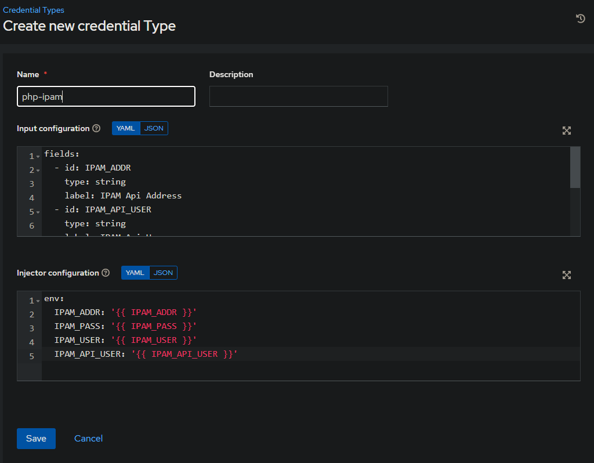
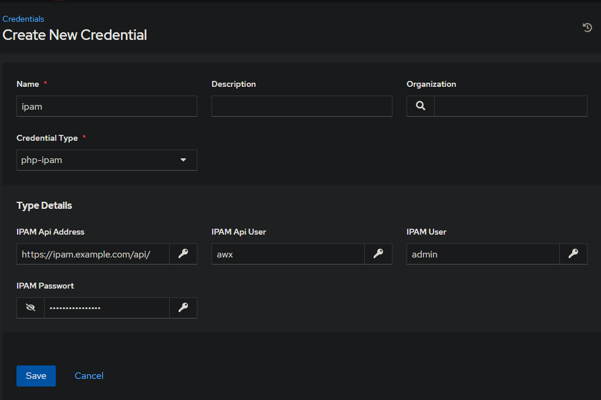
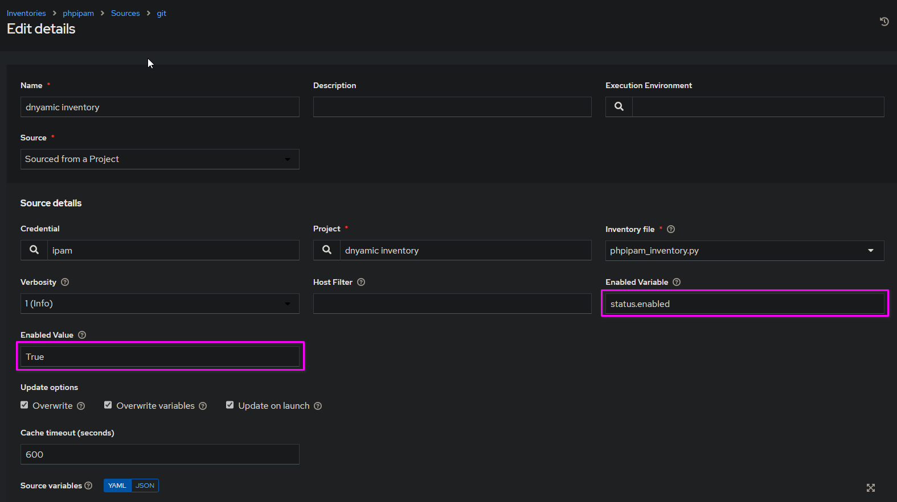
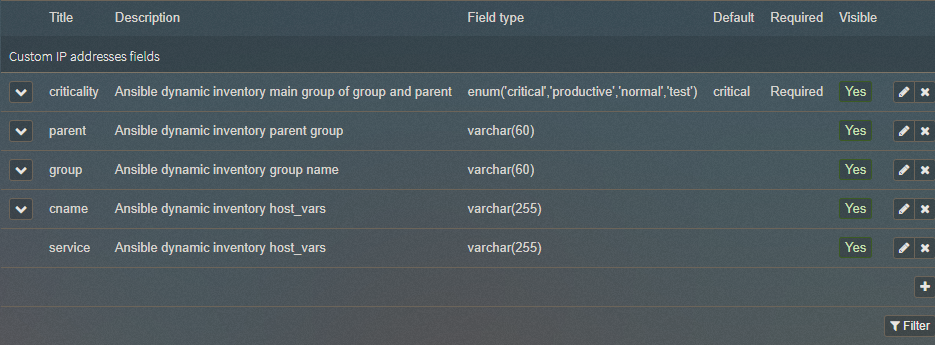
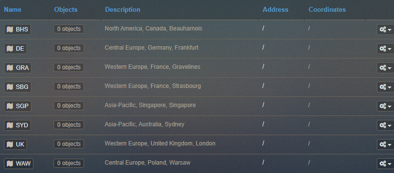
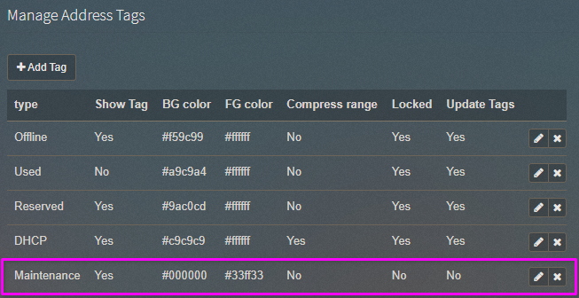
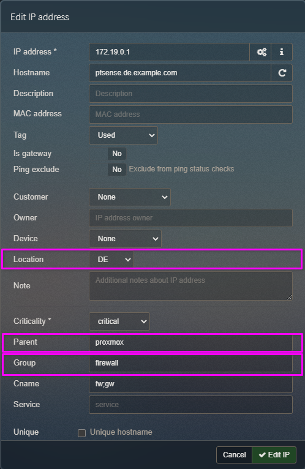
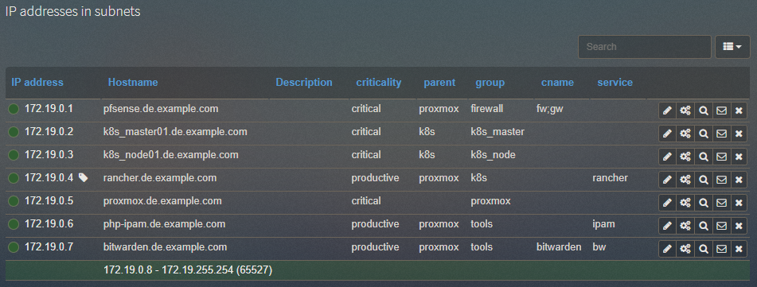

# phpIPAM Inventory
---
Thanks to [Poorya Sheikh](https://github.com/pooryasheikh/phpipam-inventory) for his inventory script.

Differences from the original:
- Subgroups can theoretically be nested infinitely
- A parent group can be a subgroup of a group
- Added field for cnames to create CNAME in DNS zone files
- Added field for service to create ALIAS in DNS zone files
- Added field for criticality
- Hosts can now be addressed by their group, parent group, criticality and location
- Added online status check to disable host in inventory
- Host is disabled when tagged on maintenance
- IP address is added to the host vars
- Minor code changes I can't remember
---

phpIPAM Inventory is an inventory script for Ansible and AWX.

## Configuration

**STEP 1)** Create a new creredential type in AWX:



**Input configuration:**

```yaml
fields:
  - id: IPAM_ADDR
    type: string
    label: IPAM Api Address
  - id: IPAM_API_USER
    type: string
    label: IPAM Api User
  - id: IPAM_USER
    type: string
    label: IPAM User
  - id: IPAM_PASS
    type: string
    label: IPAM Passwort
    secret: true

```

**Injector configuration**:

```yaml
env:
  IPAM_ADDR: '{{ IPAM_ADDR }}'
  IPAM_PASS: '{{ IPAM_PASS }}'
  IPAM_USER: '{{ IPAM_USER }}'
  IPAM_API_USER: '{{ IPAM_API_USER }}'

```

**STEP 2)** Create a new creredential:



**STEP 3)** Set enable varibale in AWX inventory source options:



**STEP 4)** Create Custom fields in phpIPAM for IP Addresses:



**STEP 5)** Create locations in phpIPAM:



**STEP 6)** Create maintenance tag in phpIPAM:



**STEP 7)** In IP address, fill a name for custom field group and if you want this group has a parent group also fill a name in parent custom field. Add cname, service,tag and criticality as you see fit:



*IP Addresses without location field will not present in inventory output!*

### Example inventory



## Group vars and host vars
All vars should be static in the directory of the dynamic inventory:

### Directory Layout
Any group_vars and host_vars subdirectories in an inventory directory will be interpreted as expected.

```text
inventory
├── group_vars
│   ├── prod
│   ├── stage
│   ├── databases
│   ├── posgresql-prod
│   ├── mysql-prod
│   ├── webserver-prod
│   └── webserver-stage
├── host_vars
└── phpipam_inventory.py
```

### How variables are merged
By default, variables are merged/flattened to the specific host before a play is run. This keeps Ansible focused on the Host and Task, so groups don’t survive outside of inventory and host matching. By default, Ansible overwrites variables including the ones defined for a group and/or host. The order/precedence is (from lowest to highest):

* all group (because it is the ‘parent’ of all other groups)
* parent group
* child group
* host

## Usage

```bash
python inventory/phpipam_inventory.py --list
```
*Use **--list --refresh** for refresh cache file!*

### With ansible-inventory:

```bash
ansible-inventory inventory/phpipam_inventory.py --list
```

## Output
```json
# ansible-inventory --inventory=inventory/phpipam_inventory.py --list
{
    "_meta": {
        "hostvars": {
            "bitwarden.de.example.com": {
                "ansible_host": "172.19.0.7",
                "cname": "bitwarden",
                "service": "bw",
                "service_ntp": true,
                "status": {
                    "enabled": true
                }
            },
            "k8s_master01.de.example.com": {
                "ansible_host": "172.19.0.2",
                "service_ntp": true,
                "status": {
                    "enabled": true
                }
            },
            "k8s_node01.de.example.com": {
                "ansible_host": "172.19.0.3",
                "service_ntp": true,
                "status": {
                    "enabled": true
                }
            },
            "pfsense.de.example.com": {
                "ansible_host": "172.19.0.1",
                "cname": "fw;gw",
                "service_ntp": true,
                "status": {
                    "enabled": true
                }
            },
            "php-ipam.de.example.com": {
                "ansible_host": "172.19.0.6",
                "service": "ipam",
                "service_ntp": true,
                "status": {
                    "enabled": true
                }
            },
            "proxmox.de.example.com": {
                "ansible_host": "172.19.0.5",
                "service_ntp": true,
                "status": {
                    "enabled": true
                }
            },
            "rancher.de.example.com": {
                "ansible_host": "172.19.0.4",
                "service": "rancher",
                "service_ntp": true,
                "status": {
                    "enabled": false
                }
            }
        }
    },
    "all": {
        "children": [
            "ungrouped",
            "uk",
            "gra",
            "sbg",
            "bhs",
            "waw",
            "syd",
            "sgp",
            "de",
            "critical",
            "k8s_master",
            "k8s",
            "k8s_node",
            "productive",
            "proxmox",
            "tools",
            "firewall"
        ]
    },
    "critical": {
        "children": [
            "firewall_critical"
        ]
    },
    "de": {
        "children": [
            "k8s_master_de",
            "k8s_de",
            "k8s_node_de",
            "proxmox_de",
            "tools_de",
            "firewall_de"
        ]
    },
    "firewall": {
        "children": [
            "firewall_de",
            "firewall_critical"
        ]
    },
    "firewall_critical": {
        "hosts": [
            "pfsense.de.example.com"
        ]
    },
    "firewall_de": {
        "hosts": [
            "pfsense.de.example.com"
        ]
    },
    "k8s": {
        "children": [
            "k8s_de",
            "k8s_critical",
            "k8s_productive"
        ]
    },
    "k8s_critical": {
        "children": [
            "k8s_master_critical",
            "k8s_node_critical"
        ]
    },
    "k8s_de": {
        "children": [
            "k8s_master_de",
            "k8s_node_de"
        ],
        "hosts": [
            "rancher.de.example.com"
        ]
    },
    "k8s_master": {
        "children": [
            "k8s_master_de",
            "k8s_master_critical"
        ]
    },
    "k8s_master_critical": {
        "hosts": [
            "k8s_master01.de.example.com"
        ]
    },
    "k8s_master_de": {
        "hosts": [
            "k8s_master01.de.example.com"
        ]
    },
    "k8s_node": {
        "children": [
            "k8s_node_de",
            "k8s_node_critical"
        ]
    },
    "k8s_node_critical": {
        "hosts": [
            "k8s_node01.de.example.com"
        ]
    },
    "k8s_node_de": {
        "hosts": [
            "k8s_node01.de.example.com"
        ]
    },
    "k8s_productive": {
        "hosts": [
            "rancher.de.example.com"
        ]
    },
    "proxmox": {
        "children": [
            "proxmox_de",
            "proxmox_productive",
            "proxmox_critical"
        ]
    },
    "proxmox_critical": {
        "children": [
            "firewall_critical"
        ],
        "hosts": [
            "proxmox.de.example.com"
        ]
    },
    "proxmox_de": {
        "children": [
            "k8s_de",
            "tools_de",
            "firewall_de"
        ],
        "hosts": [
            "proxmox.de.example.com"
        ]
    },
    "proxmox_productive": {
        "children": [
            "k8s_productive",
            "tools_productive"
        ]
    },
    "tools": {
        "children": [
            "tools_de",
            "tools_productive"
        ]
    },
    "tools_de": {
        "hosts": [
            "php-ipam.de.example.com",
            "bitwarden.de.example.com"
        ]
    },
    "tools_productive": {
        "hosts": [
            "php-ipam.de.example.com",
            "bitwarden.de.example.com"
        ]
    }
}
```


## Contributing
Pull requests are welcome. For major changes, please open an issue first to discuss what you would like to change.

Please make sure to update the tests as appropriate.

## License
[MIT](https://choosealicense.com/licenses/mit/)
